# 🚀 Cache va Django - To'liq Qo'llanma

  

---

## 📋 Mundarija

- [Cache nima?](#-cache-nima)
- [Cache qayerlarda ishlatiladi](#-cache-qayerlarda-ishlatiladi)
- [Django da Cache](#-django-da-cache)
- [Cache turlari](#-cache-turlari)
- [Arxitektura](#-arxitektura)
- [Amaliy misollar](#-amaliy-misollar)
- [Afzalliklar](#-afzalliklar)
- [Best Practices](#-best-practices)

---

## 💡 Cache nima?

**Cache** - tez-tez foydalaniladigan ma'lumotlarni vaqtincha saqlash mexanizmi bo'lib, tizim samaradorligini sezilarli darajada oshiradi.


---

## 🌍 Cache qayerlarda ishlatiladi?

### 1. **Web Development**


- **CDN (Content Delivery Network)**: Statik fayllar
- **Browser Cache**: HTML, CSS, JS, rasmlar
- **Server-side Cache**: Ma'lumotlar bazasi so'rovlari
- **Application Cache**: Hisoblash natijalari

### 2. **Mobil Ilovalar**


- **Offline rejim** uchun ma'lumotlar
- **Rasmlar va media fayllar**
- **API javoblari**
- **Foydalanuvchi ma'lumotlari**

### 3. **Ma'lumotlar Bazasi**


- **Query Cache**: So'rovlar natijalari
- **Buffer Pool**: Ma'lumot sahifalari
- **Index Cache**: Indeks ma'lumotlari

### 4. **Operatsion Tizim**


- **File System Cache**
- **Page Cache**
- **Disk Buffer**

### 5. **Mikroservislar**


- **Distributed Cache** (Redis, Memcached)
- **Session Management**
- **API Response Caching**

---

## 🐍 Django da Cache

### Cache Framework Arxitekturasi


### 1. **Cache Sozlamalari**

```python
# settings.py
CACHES = {
    'default': {
        'BACKEND': 'django.core.cache.backends.redis.RedisCache',
        'LOCATION': 'redis://127.0.0.1:6379/1',
        'OPTIONS': {
            'CLIENT_CLASS': 'django_redis.client.DefaultClient',
        },
        'KEY_PREFIX': 'myproject',
        'TIMEOUT': 300,  # 5 daqiqa
        'VERSION': 1,
    },
    'sessions': {
        'BACKEND': 'django.core.cache.backends.redis.RedisCache',
        'LOCATION': 'redis://127.0.0.1:6379/2',
        'TIMEOUT': 86400,  # 1 kun
    }
}
```

### 2. **Cache Backends**

| Backend | Tezlik | Hajm | Distributed | Use Case |
|---------|--------|------|-------------|----------|
| **Redis** | ⚡⚡⚡ | 🗂️🗂️🗂️ | ✅ | Production |
| **Memcached** | ⚡⚡⚡ | 🗂️🗂️ | ✅ | High Traffic |
| **Database** | ⚡ | 🗂️🗂️🗂️🗂️ | ❌ | Simple Setup |
| **File** | ⚡⚡ | 🗂️🗂️🗂️🗂️ | ❌ | Development |
| **Dummy** | ❌ | ❌ | ❌ | Testing |

### 3. **Cache Levels**


### 4. **Amaliy Misollar**

#### Site-wide Cache
```python
# settings.py
MIDDLEWARE = [
    'django.middleware.cache.UpdateCacheMiddleware',
    'django.middleware.common.CommonMiddleware',
    'django.middleware.cache.FetchFromCacheMiddleware',
]

CACHE_MIDDLEWARE_ALIAS = 'default'
CACHE_MIDDLEWARE_SECONDS = 600
CACHE_MIDDLEWARE_KEY_PREFIX = ''
```

#### Per-view Cache
```python
from django.views.decorators.cache import cache_page
from django.utils.decorators import method_decorator

# Function-based view
@cache_page(60 * 15)  # 15 daqiqa
def product_list(request):
    products = Product.objects.all()
    return render(request, 'products/list.html', {'products': products})

# Class-based view
@method_decorator(cache_page(60 * 15), name='dispatch')
class ProductListView(ListView):
    model = Product
    template_name = 'products/list.html'
```

#### Template Fragment Cache
```html
<!-- template.html -->


<div class="product-list">
    
        
            <div class="product-item">
                <h3>{{ product.name }}</h3>
                <p>{{ product.price }}</p>
            </div>
        
    
</div>
```

#### Low-level Cache API
```python
from django.core.cache import cache
from django.core.cache.utils import make_template_fragment_key

# Ma'lumot saqlash
def get_expensive_data(user_id):
    cache_key = f'expensive_data_{user_id}'
    data = cache.get(cache_key)
    
    if data is None:
        # Qimmat hisoblash
        data = perform_expensive_calculation(user_id)
        cache.set(cache_key, data, timeout=3600)  # 1 soat
    
    return data

# Template fragment cache ni tozalash
def clear_product_cache(user_id):
    key = make_template_fragment_key('product_list', [user_id])
    cache.delete(key)
```

#### Database Query Cache
```python
from django.db import models
from django.core.cache import cache

class ProductManager(models.Manager):
    def get_featured_products(self):
        cache_key = 'featured_products'
        products = cache.get(cache_key)
        
        if products is None:
            products = list(
                self.filter(is_featured=True)
                .select_related('category')
                .prefetch_related('images')
            )
            cache.set(cache_key, products, timeout=1800)  # 30 daqiqa
        
        return products

class Product(models.Model):
    name = models.CharField(max_length=200)
    price = models.DecimalField(max_digits=10, decimal_places=2)
    is_featured = models.BooleanField(default=False)
    
    objects = ProductManager()
```

### 5. **Cache Invalidation**

```python
from django.db.models.signals import post_save, post_delete
from django.dispatch import receiver
from django.core.cache import cache

@receiver([post_save, post_delete], sender=Product)
def invalidate_product_cache(sender, **kwargs):
    # Featured products cache ni tozalash
    cache.delete('featured_products')
    
    # User-specific cache larni tozalash
    cache.delete_many([
        'product_list_*',
        'category_products_*'
    ])

# Custom cache invalidation
class CacheManager:
    @staticmethod
    def invalidate_user_cache(user_id):
        patterns = [
            f'user_data_{user_id}',
            f'user_orders_{user_id}',
            f'user_wishlist_{user_id}'
        ]
        cache.delete_many(patterns)
```

---

## 🏗️ Cache Turlari

### 1. **Memory Cache Arxitekturasi**


### 2. **Distributed Cache**


### 3. **Multi-level Cache**


---

## ⚡ Afzalliklar

### 1. **Performance**

```mermaid
graph LR
    A[Without Cache] --> B[1000ms Response]
    C[With Cache] --> D[50ms Response]
    
    B --> E[20x Slower]
    D --> F[Database Load ↓90%]
```


- **Response Time**: 90-95% kamayish
- **Database Queries**: 80-90% kamayish
- **Server Load**: 70-85% kamayish

### 2. **Scalability**


### 3. **Cost Reduction**
- **Server Resources**: Kam server kerak
- **Database License**: Kam connection
- **Bandwidth**: CDN orqali tejash

---

## 📊 Performance Metrics

### Django Cache Performance

```python
# Performance monitoring
import time
from functools import wraps
from django.core.cache import cache

def cache_performance(cache_key):
    def decorator(func):
        @wraps(func)
        def wrapper(*args, **kwargs):
            start_time = time.time()
            
            # Cache dan olishga harakat
            result = cache.get(cache_key)
            if result is not None:
                cache_time = time.time() - start_time
                print(f"Cache Hit: {cache_time:.4f}s")
                return result
            
            # Function ni ishga tushirish
            result = func(*args, **kwargs)
            execution_time = time.time() - start_time
            
            # Cache ga saqlash
            cache.set(cache_key, result, timeout=300)
            print(f"Cache Miss: {execution_time:.4f}s")
            
            return result
        return wrapper
    return decorator

# Foydalanish
@cache_performance('expensive_calculation')
def expensive_calculation():
    time.sleep(2)  # 2 soniya kutish
    return "Expensive result"
```

---

## 🔧 Best Practices

### 1. **Cache Key Strategy**
```python
# Yaxshi cache key nomenklaturasi
CACHE_KEYS = {
    'USER_PROFILE': 'user:profile:{user_id}',
    'PRODUCT_LIST': 'product:list:page:{page}:category:{cat_id}',
    'SEARCH_RESULTS': 'search:{query}:page:{page}',
}

def get_cache_key(template, **kwargs):
    return template.format(**kwargs)

# Foydalanish
cache_key = get_cache_key(
    CACHE_KEYS['PRODUCT_LIST'], 
    page=1, 
    cat_id=5
)
```

### 2. **Cache Timeout Strategy**
```python
# Turli xil timeout larni belgilash
CACHE_TIMEOUTS = {
    'STATIC_DATA': 86400,      # 1 kun
    'USER_SESSION': 3600,      # 1 soat  
    'SEARCH_RESULTS': 900,     # 15 daqiqa
    'REAL_TIME_DATA': 60,      # 1 daqiqa
}
```

### 3. **Cache Warming**
```python
# Cache ni oldindan to'ldirish
from django.core.management.base import BaseCommand

class Command(BaseCommand):
    def handle(self, *args, **options):
        # Mashhur ma'lumotlarni cache ga yuklash
        self.warm_featured_products()
        self.warm_categories()
        self.warm_popular_searches()
    
    def warm_featured_products(self):
        products = Product.objects.get_featured_products()
        cache.set('featured_products', products, timeout=3600)
        self.stdout.write('Featured products cached!')
```

### 4. **Cache Monitoring**
```python
# Cache statistikasini kuzatish
class CacheStatsMiddleware:
    def __init__(self, get_response):
        self.get_response = get_response
        self.cache_hits = 0
        self.cache_misses = 0
    
    def __call__(self, request):
        # Request processing
        response = self.get_response(request)
        
        # Cache stats ni header ga qo'shish
        if settings.DEBUG:
            response['X-Cache-Hits'] = str(self.cache_hits)
            response['X-Cache-Misses'] = str(self.cache_misses)
        
        return response
```

---

## 🚨 Cache Pitfalls

### 1. **Cache Stampede**
```python
# Muammo: Ko'p so'rov bir vaqtda cache miss
# Yechim: Lock mechanism
import threading
from django.core.cache import cache

_locks = {}

def get_with_lock(cache_key, fetch_func, timeout=300):
    result = cache.get(cache_key)
    if result is not None:
        return result
    
    # Lock yaratish
    if cache_key not in _locks:
        _locks[cache_key] = threading.Lock()
    
    with _locks[cache_key]:
        # Yana cache dan tekshirish
        result = cache.get(cache_key)
        if result is not None:
            return result
        
        # Ma'lumotni olish va cache ga saqlash
        result = fetch_func()
        cache.set(cache_key, result, timeout)
        return result
```

### 2. **Cache Consistency**
```python
# Database va cache ni sinxronlash
from django.db import transaction

def update_product_with_cache(product_id, data):
    with transaction.atomic():
        # Database ni yangilash
        product = Product.objects.get(id=product_id)
        for key, value in data.items():
            setattr(product, key, value)
        product.save()
        
        # Cache ni tozalash
        cache_keys = [
            f'product:{product_id}',
            'featured_products',
            f'category_products:{product.category_id}'
        ]
        cache.delete_many(cache_keys)
```

---

## 🔍 Debugging Cache

### Django Debug Toolbar bilan
```python
# settings.py
if DEBUG:
    INSTALLED_APPS += ['debug_toolbar']
    MIDDLEWARE += ['debug_toolbar.middleware.DebugToolbarMiddleware']
    
    DEBUG_TOOLBAR_PANELS = [
        'debug_toolbar.panels.cache.CachePanel',
        # boshqa panellar...
    ]
```

### Cache qiymatlarini ko'rish
```python
# Management command
from django.core.management.base import BaseCommand
from django.core.cache import cache

class Command(BaseCommand):
    def add_arguments(self, parser):
        parser.add_argument('--key', type=str, help='Cache key')
    
    def handle(self, *args, **options):
        if options['key']:
            value = cache.get(options['key'])
            self.stdout.write(f"Cache value: {value}")
        else:
            # Barcha cache key larni ko'rsatish (Redis)
            import redis
            r = redis.Redis(host='localhost', port=6379, db=1)
            keys = r.keys('*')
            for key in keys:
                self.stdout.write(key.decode())
```

---

## 📈 Real-world Example

### E-commerce saytida Cache
```python
# views.py
from django.views.generic import ListView
from django.core.cache import cache
from django.utils.decorators import method_decorator
from django.views.decorators.cache import cache_page

class ProductListView(ListView):
    model = Product
    template_name = 'products/list.html'
    paginate_by = 20
    
    def get_queryset(self):
        category_id = self.request.GET.get('category')
        cache_key = f'products:category:{category_id}:page:{self.request.GET.get("page", 1)}'
        
        products = cache.get(cache_key)
        if products is None:
            queryset = Product.objects.filter(is_active=True)
            if category_id:
                queryset = queryset.filter(category_id=category_id)
            
            products = list(queryset.select_related('category')
                           .prefetch_related('images'))
            cache.set(cache_key, products, timeout=1800)
        
        return products
    
    def get_context_data(self, **kwargs):
        context = super().get_context_data(**kwargs)
        
        # Categories ni cache dan olish
        categories = cache.get('categories_list')
        if categories is None:
            categories = list(Category.objects.filter(is_active=True))
            cache.set('categories_list', categories, timeout=3600)
        
        context['categories'] = categories
        return context
```

---

## 🎯 Xulosa

Cache - zamonaviy web-ilovalarning ajralmas qismi. Django da to'g'ri ishlatilganda:

- **90%+ performance yaxshilanish**
- **Database load kamayishi**  
- **Better user experience**
- **Cost reduction**
- **High scalability**

Cache ni doimo **monitoring** qiling va **best practices** ga amal qiling!

---

## 📚 Qo'shimcha Resurslar

- [Django Cache Framework](https://docs.djangoproject.com/en/stable/topics/cache/)
- [Redis Documentation](https://redis.io/documentation)
- [Memcached Guide](https://memcached.org/)
- [Cache Patterns](https://martinfowler.com/articles/patterns-of-distributed-systems/cache-patterns.html)

---

**Made with ❤️ for Django Developers**
